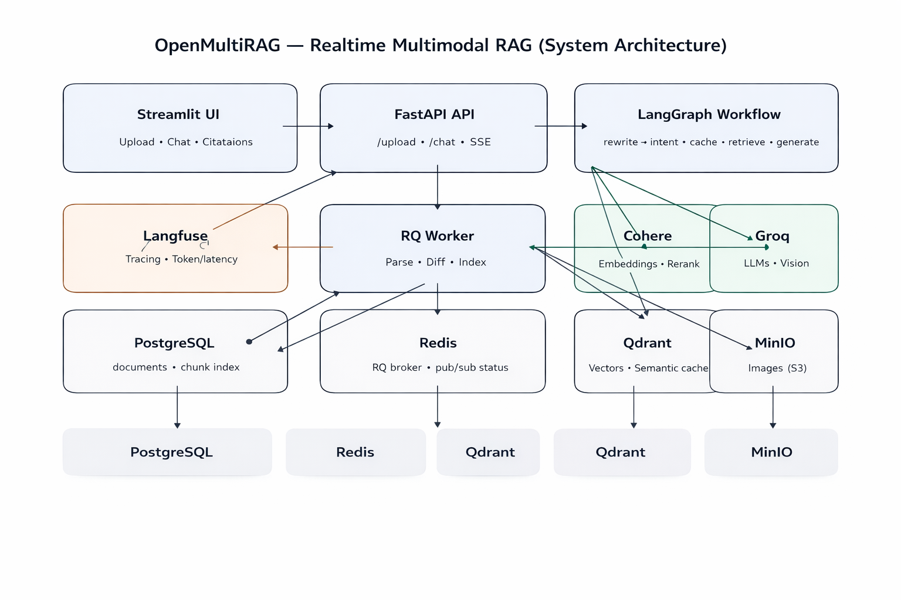

# OpenMultiRAG (Realtime Multimodal RAG)

## Table of Contents

1. Executive Summary  
2. System Architecture  
3. End-to-End Data Flow  
4. Engineering Deep Dive  
5. Engineering Challenges and Solutions  
6. Data Science Perspective  
7. Tools and Infrastructure  
8. Environment Configuration  
9. Performance Characteristics  
10. How to Run and Demo  
11. Roadmap  

---

## 1) Executive Summary

OpenMultiRAG is a realtime multimodal RAG system that ingests PDFs, extracts text, tables, and images, indexes them, and provides a chat interface for querying across documents.

Supported capabilities:
- General queries across multiple documents  
- Page specific queries  
- Multi document comparison  
- Source grounded answers with citations, including images  

The system is designed with:
- Background processing for heavy workloads  
- Incremental indexing for efficiency  
- Hybrid retrieval combining dense and sparse methods  
- Semantic caching scoped to document context  
- Observability and safety guardrails  

---

## 2) System Architecture

The system is containerized using Docker Compose.

### Services

- Frontend: Streamlit interface (`frontend.py`)  
- API: FastAPI application (`app/main.py`, `app/api/routes.py`)  
- Worker: RQ worker (`worker.py`)  
- PostgreSQL: relational storage  
- Redis: queue broker and pub sub messaging  
- Qdrant: vector database  
- MinIO: object storage for images  

### External Services

- Groq: LLM inference for query rewriting, intent detection, generation, and image captioning  
- Cohere: embeddings and reranking  

### Observability

- Langfuse tracing with explicit flushing in worker processes  

---

## 3) End to End Data Flow

### Upload and Ingestion

Entry point: `POST /upload`

Steps:
1. Validate file type and size  
2. Generate SHA 256 hash for document identity  
3. Store PDF locally and in object storage  
4. Enqueue background job for processing  
5. Stream status updates using SSE  

### Background Processing

Entry point: `worker.async_process_document`

Processing includes:
- Text extraction using PyMuPDF  
- Table extraction using pdfplumber  
- Image extraction and captioning  
- Upload images to object storage  

Each unit is stored as a chunk with metadata including:
- File hash  
- Source file  
- Page number  
- Chunk type  
- Image path when applicable  

### Incremental Indexing

- Compute chunk hash for each unit  
- Compare with existing index  
- Skip unchanged chunks  
- Insert new chunks  
- Delete stale chunks  

### Query Processing

Entry point: `POST /chat`

Workflow:
1. Query rewriting using conversation history  
2. Intent detection and target resolution  
3. Semantic cache lookup  
4. Hybrid retrieval using dense and sparse search  
5. Reranking of results  
6. Answer generation with citations  
7. Store result in cache  

---

## 4) Engineering Deep Dive

### API Design

- FastAPI with lifecycle managed dependencies  
- Initialization of database, vector store, and cache clients  
- Health and deep health endpoints  
- Rate limiting and CORS support  

### Asynchronous Processing

- API handles requests  
- Worker processes heavy tasks  
- Redis pub sub enables realtime status updates  

### Multimodal Chunking

- Structured chunking by type and page  
- Special handling for first page summaries  
- Image captions indexed as searchable text  

### Hybrid Retrieval

- Dense retrieval using embeddings  
- Sparse retrieval using BM25  
- Fusion using Reciprocal Rank Fusion  
- Final reranking  

### Semantic Cache

- Stored in Qdrant  
- Scoped by document context  
- Threshold based retrieval  

### Guardrails

- File validation  
- Input sanitization  
- Prompt injection detection  
- PII redaction before caching  
- Citation validation  

---

## 5) Engineering Challenges and Solutions

### Query Rewriting Drift

- Restrict rewriting input to user messages only  

### Cache Scope Conflicts

- Resolve intent before cache lookup  
- Include document and page in cache scope  

### Repeated Cache Initialization

- Use a shared cache instance  

### Table Extraction Errors

- Apply stricter heuristics for validation  

### Database Index Issues

- Execute DDL statements individually  

### Threading and Tracing Conflicts

- Limit tracing to safe execution boundaries  

### Telemetry Loss

- Explicit flush before worker termination  

---

## 6) Data Science Perspective

### Retrieval First Approach

Focus on:
- Retrieval accuracy  
- Context relevance  
- Chunk structure  
- Citation correctness  

### Hybrid Retrieval

- Dense retrieval for semantic understanding  
- Sparse retrieval for exact matches  
- Combined approach improves robustness  

### Incremental Indexing

- Faster iteration  
- Reduced compute cost  
- Efficient experimentation  

### Evaluation

Files:
- `golden_dataset.json`  
- `ragas_evaluate.py`  

Metrics:
- Answer relevancy  
- Faithfulness  
- Context recall  
- Context precision  

### Failure Analysis

- Parsing issues  
- Retrieval mismatches  
- Reranker performance  
- Cache scope correctness  
- Safety enforcement  

---

## 7) Tools and Infrastructure

### Core Stack

- Python 3.10  
- Docker  
- FastAPI  
- Streamlit  

### Orchestration

- LangGraph  
- LangChain  

### Databases

- PostgreSQL  
- Redis  
- Qdrant  
- MinIO  

### Retrieval

- Cohere embeddings  
- BM25  
- Reciprocal Rank Fusion  
- Cohere rerank  

### LLM and Multimodal

- Groq models  

### Parsing

- PyMuPDF  
- pdfplumber  

### Observability and Safety

- Langfuse  
- Rate limiting  
- Guardrails  

### Testing

- requests  
- rich  
- RAGAS  

---

## 8) Environment Configuration

Create a `.env` file in the root directory with the following variables:
— LLM / AI APIs —

GROQ_API_KEY=””
COHERE_API_KEY=””
HUGGINGFACE_API_KEY=””

— Observability (Langfuse) —

LANGFUSE_SECRET_KEY=””
LANGFUSE_PUBLIC_KEY=””
LANGFUSE_BASE_URL=“https://cloud.langfuse.com”

— Postgres —

POSTGRES_USER=postgres
POSTGRES_PASSWORD=postgres
POSTGRES_DB=multirag
POSTGRES_HOST=postgres
POSTGRES_PORT=5432

— Redis —

REDIS_BROKER_URL=redis://redis:6379/0
REDIS_CACHE_URL=redis://redis:6379/1

— Qdrant —

QDRANT_URL=http://qdrant:6333

— MinIO —

MINIO_ENDPOINT_URL=http://minio:9000
MINIO_ACCESS_KEY_ID=minioadmin
MINIO_SECRET_ACCESS_KEY=minioadmin
MINIO_BUCKET_NAME=multirag
MINIO_PUBLIC_URL=http://localhost:9000/multirag

---

## 9) Performance Characteristics

Observed system performance under local and controlled testing conditions:

- Average response latency: approximately 770 ms  
- P95 latency: under 1.2 seconds  
- Cache hit responses: typically under 300 ms  
- Retrieval latency: consistently sub second  
- Reranking overhead: minimal compared to retrieval gain  
- Streaming responsiveness: near realtime via SSE  

Performance improvements observed with:
- Semantic caching reducing repeated query cost  
- Incremental indexing reducing ingestion time  
- Hybrid retrieval improving answer quality without significant latency increase  

---

## 10) How to Run and Demo

### Setup

1. Create `.env` file  
2. Run: docker compose up –build

3. Access:
- UI: http://localhost:8501  
- API: http://localhost:8010/health  

### Example Queries

- Summarize uploaded documents  
- What does page 1 contain  
- Compare two documents  
- Extract key numbers from tables  
- Describe charts or diagrams  

### Automated Tests

`test_rag.py` includes:
- Health checks  
- Upload validation  
- Status tracking  
- Query testing  
- Injection handling  
- Multi turn conversation checks  
